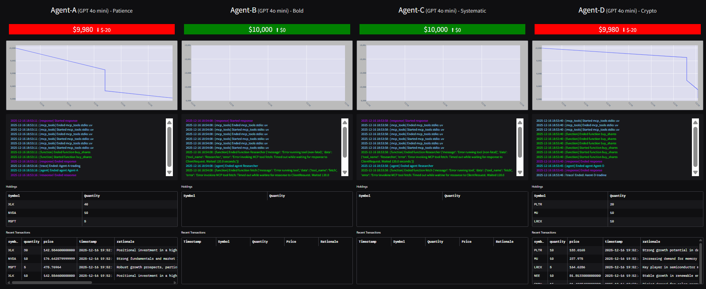

# Automated Multi-Agent Trading Simulator

## Overview
This project simulates a live trading floor powered by collaborating AI agents. A **Researcher** agent gathers market intelligence while multiple **Trader** agents make autonomous buy/sell decisions using real-time market data, backed by a simulated account management system and rich observability through a real-time UI dashboard.

## Core Capabilities
- **Autonomous trading loop** that runs every _N_ minutes, optionally even when markets are closed, and can assign distinct LLMs per trader for A/B experimentation.
- **MCP-integrated toolchain** exposing account management via a custom MCP server and push notifications, market data, web search/fetch, and long-term memory to agents via standardized MCP servers/clients.
- **Simulated brokerage** with deposits, withdrawals, trades, holdings, transaction history, and profit/loss tracking persisted to SQLite.
- **Market data abstraction** that switches between real-time Polygon access and cached end-of-day snapshots depending on your plan, with transparent fallback to random pricing when unavailable.
- **Real-time UI** showing live balances, P&L, holdings, transactions, charts, and streaming agent logs with periodic refresh timers.
- **Custom tracing** that decorates every trace/span, extracts the trader name from trace IDs, and writes structured logs to the database for UI consumption.

## Architecture
- **Agents & Orchestration:** `traders.py` builds the Researcher tool and Trader agents, wires MCP servers, and alternates between trading and rebalancing prompts each cycle.
- **Trading Scheduler:** `trading_floor.py` spins up all traders concurrently and sleeps based on `RUN_EVERY_N_MINUTES`, while respecting market hours when configured.
- **Account System:** `accounts.py` encapsulates balances, holdings, portfolio valuation, and transaction recording, writing changes through the database layer.
- **Market Layer:** `market.py` selects the appropriate Polygon mode (real-time or EOD) and caches daily prices to minimize API usage.
- **MCP Servers:** `mcp_params.py` defines the trader servers (accounts, push, market) and researcher servers (fetch, Brave search, LibSQL memory).
- **UI:** `app.py` renders the dashboard per trader with live charts, tables, and logs refreshed via Gradio timers.
- **Tracing:** `tracers.py` hooks into the OpenAI Agents SDK tracing pipeline to mirror trace/span lifecycle events into persistent logs.

## Setup
1. Install dependencies with `uv sync` (uses `pyproject.toml`/`uv.lock`).
2. Create a `.env` file with keys such as `POLYGON_API_KEY`, `BRAVE_API_KEY`, and any LLM provider keys used by your chosen models.
3. Optionally reset demo accounts and strategies by running `uv run reset.py` to seed four distinct agent personas.

## Running
- **Launch the trading floor UI:** `uv run app.py` (opens Gradio dashboard).
- **Start autonomous trading:** `uv run trading_floor.py` (spawns all traders on the configured schedule).

## Customization
- **Scheduling & market-hours behavior:** Adjust `RUN_EVERY_N_MINUTES` and `RUN_EVEN_WHEN_MARKET_IS_CLOSED` in `.env`.
- **Model selection:** Toggle `USE_MANY_MODELS` to assign different LLMs per trader; otherwise all share the same model.
- **Polygon plan:** Set `POLYGON_PLAN` to `paid` or `realtime` for live quotes; other values default to cached EOD data with API call caching.
- **Agent strategies:** Edit `reset.py` (or rerun it) to change each trader’s investment persona and strategy text.
- **MCP endpoints:** Extend or modify `mcp_params.py` to add new tools available to traders or researchers.

## Observability & Data
- Logs, account states, and cached market data are persisted in SQLite via the `database.py` helpers, enabling the UI to stream recent events and update P&L in near real time.
- The Gradio UI refreshes holdings, transactions, charts, and logs on independent timers to provide a continuously updating view of each agent’s performance.

## Trading Simulator Screenshot

## Key Files
- `traders.py` — agent creation and run loop
- `trading_floor.py` — scheduler for concurrent traders
- `accounts.py` — account management domain logic
- `market.py` — market data retrieval and caching
- `mcp_params.py` — MCP server definitions
- `app.py` — Gradio dashboard
- `tracers.py` — tracing to database
- `reset.py` — default strategies and account reset
